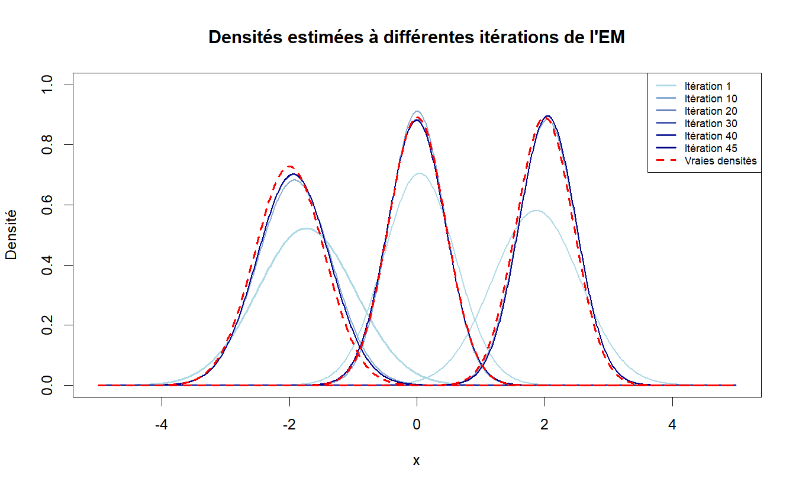
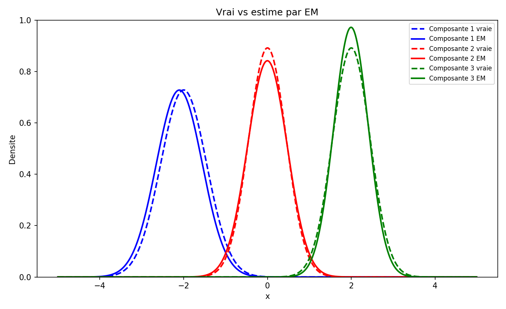
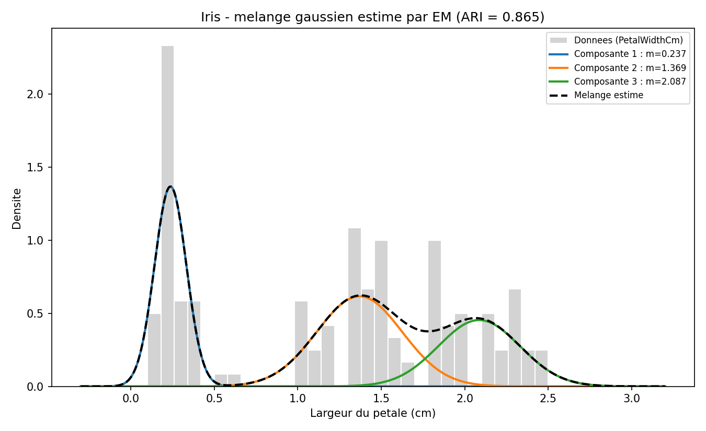

# Algorithme EM — Application aux mélanges gaussiens

> **TER (Travail d'Étude et de Recherche) — M1 IMSD**
> Université de Lorraine, Faculté des Sciences — Année 2025–2026

Étude théorique et numérique de l'algorithme **EM (Expectation-Maximization)** pour l'estimation par maximum de vraisemblance en présence de variables latentes, appliquée aux **mélanges finis de lois gaussiennes**.

L'algorithme est entièrement **implémenté from scratch en R** — les étapes E et M sont codées à la main, sans recours à une librairie de mixture models — puis validé sur données simulées et appliqué à des données réelles.

📄 **[Rapport complet (31 pages)](rapport/rapport-TER-algorithme-EM.pdf)** · 🎤 **[Slides de soutenance](presentation/soutenance-convergence-EM.pdf)** · 📋 **[Sujet du TER](rapport/sujet-TER.pdf)**

---

## Le problème

Sur une île vivent plusieurs espèces de mouettes. On cherche la proportion de chacune dans la population, mais compter les oiseaux est impossible : ils volent, se déplacent, se cachent. Les **nids**, eux, restent en place.

Problème : les nids se ressemblent trop pour qu'on distingue l'espèce à l'œil nu. En revanche, la **taille** d'un nid suit une loi propre à chaque espèce. On observe donc la taille X, mais l'espèce Z qui l'a construit reste **cachée** — c'est la variable latente du modèle.

La distribution des tailles observées est alors un mélange de J gaussiennes. L'objectif est d'estimer les proportions, moyennes et variances de chaque composante à partir des seules tailles observées.

---

## Contenu du dépôt

- **[rapport/](rapport/)** — [rapport complet](rapport/rapport-TER-algorithme-EM.pdf) (31 pages) et [sujet du TER](rapport/sujet-TER.pdf)
- **[presentation/](presentation/)** — [slides de soutenance](presentation/soutenance-convergence-EM.pdf) sur la convergence de l'EM
- **[figures/](figures/)** — graphiques générés par les scripts
- **code/** — implémentation R :
  - [`em_3_gaussiennes.R`](code/em_3_gaussiennes.R) — cas de référence, composantes bien séparées
  - [`em_3_gaussiennes_proches.R`](code/em_3_gaussiennes_proches.R) — composantes qui se chevauchent
  - [`em_5_gaussiennes.R`](code/em_5_gaussiennes.R) — influence du nombre de composantes
  - [`iris/iris_em.R`](code/iris/iris_em.R) — application au dataset Iris

---

## Contenu du rapport

**1. Modèle** — modélisation par mélange de lois gaussiennes, variable latente, densités jointe, marginales et conditionnelles, formule de responsabilité obtenue par la formule de Bayes.

**2. Situation favorable mais irréaliste** — estimation lorsque les étiquettes Z sont connues, et pourquoi ce cadre ne suffit pas.

**3. Résolution du vrai problème** — le cœur théorique :

- Théorème de la log-vraisemblance conditionnelle et son maximum
- Dérivation des formules de mise à jour des paramètres
- **Théorème de croissance de la vraisemblance observée** (démonstration complète)
- Limites du résultat de monotonie
- Convergence vers un point stationnaire — Dempster, Laird et Rubin (1977)
- Conditions suffisantes de convergence — Wu (1983)

**4. Applications numériques** — validation sur données simulées, puis sur données réelles.

---

## Détails d'implémentation

L'algorithme alterne deux étapes jusqu'à convergence.

**Étape E** — calcul des responsabilités, c'est-à-dire la probabilité a posteriori que l'observation *i* provienne de la composante *k* :

```r
gamma[, k] = alpha[k] * dnorm(X, mu[k], sqrt(var[k]))
gamma[i, ] = gamma[i, ] / sum(gamma[i, ])     # normalisation par ligne
```

**Étape M** — mise à jour des paramètres par moyennes pondérées par ces responsabilités :

```r
Nk       = sum(gamma[, k])
alpha[k] = Nk / n
mu[k]    = sum(gamma[, k] * X) / Nk
var[k]   = sum(gamma[, k] * (X - mu[k])^2) / Nk
```

**Initialisation** — proportions uniformes `alpha = 1/K` dans tous les cas, moyennes choisies pour couvrir grossièrement le support des données :

| Script | `mu` initial | `var` initial |
|---|---|---|
| `em_3_gaussiennes.R` | (-1.5, 0.2, 1.8) | 0.5 |
| `em_3_gaussiennes_proches.R` | (0, 1, 2) | 0.5 |
| `em_5_gaussiennes.R` | (-7, -4, 0.5, 2, 5) | 0.5 |
| `iris/iris_em.R` | (0.2, 1.3, 2) | 0.1 |

**Critère d'arrêt** — l'algorithme s'arrête dès que les proportions se stabilisent :

```r
if (iter > 1 && max(abs(alpha_est - alpha_old)) < 1e-6) break
```

avec un plafond de **200 itérations**. Aucun test de dégénérescence n'est implémenté : sur ces jeux de données, aucune variance ne s'effondre vers zéro.

---

## Reproductibilité

- **R** — code en base R uniquement (`dnorm`, `rnorm`, `runif`, `ks.test`), aucun package externe requis. Testé sur R 4.4.2.
- **Données** — les échantillons sont simulés à chaque exécution, sans graine fixée : les valeurs obtenues varient donc légèrement d'un run à l'autre autour de celles reportées ici.
- **Temps d'exécution** — environ 3 secondes pour n = 1000, près d'une minute pour n = 40 000.

---

## Résultats

### Convergence de l'algorithme



Les courbes bleues montrent les densités estimées à différentes itérations, du bleu clair (début) au bleu foncé (convergence) ; les densités vraies sont en rouge pointillé. À l'itération 1, les composantes sont déjà bien centrées mais trop larges et trop plates — les variances initiales sont surestimées. Elles se resserrent progressivement, et à partir de l'itération 30 le mouvement devient imperceptible : les courbes bleues recouvrent les rouges.

C'est la traduction visuelle du théorème de croissance démontré dans le rapport — à chaque itération l'estimation se rapproche du vrai modèle, sans jamais s'en éloigner.

### Validation sur données simulées

Mélange de 3 gaussiennes, alpha = (0.4, 0.4, 0.2), m = (-2, 0, 2), v = (0.3, 0.2, 0.2), n = 1000.
Convergence en **45 itérations** :

| Composante | alpha estimé (vrai) | m estimé (vrai) | v estimé (vrai) |
|---|---|---|---|
| 1 | 0.386 (0.4) | -2.027 (-2) | 0.340 (0.3) |
| 2 | 0.397 (0.4) | 0.003 (0) | 0.213 (0.2) |
| 3 | 0.217 (0.2) | 2.001 (2) | 0.195 (0.2) |

Erreurs sur les moyennes **inférieures à 0.03**. Validation par test de **Kolmogorov-Smirnov** : D = 0.0105, p = 0.9999.



### Influence du nombre de composantes

Avec 5 composantes bien séparées, l'algorithme converge en **20 itérations** avec des erreurs inférieures à 0.05 sur les moyennes (D = 0.021, p = 0.75). L'EM reste performant quand le nombre de composantes augmente, **à condition qu'elles soient suffisamment séparées**.

### Limite : composantes proches

Avec m = (0.5, 1, 1.5) — moyennes espacées de seulement 0.5 — l'algorithme converge mais les paramètres sont **sensiblement biaisés** (erreur de 0.08 sur alpha et 0.19 sur m pour la première composante). Le test de KS donne pourtant p = 0.12 : le mélange global reste un bon ajustement.

L'EM reproduit donc correctement la forme globale de la distribution mais échoue à identifier chaque composante individuellement. C'est un **problème d'identifiabilité structurel**, pas un défaut de l'algorithme.

Augmenter l'échantillon de n = 1000 à n = 40 000 améliore les moyennes (0.428, 0.946, 1.397) mais les proportions restent biaisées (0.307 au lieu de 0.4) — pour un coût qui passe de 3 secondes à près d'une minute.

### Permutation des étiquettes

La vraisemblance étant invariante par permutation des indices, l'algorithme retrouve parfaitement les trois groupes mais leur attribue une **numérotation arbitraire**. L'EM sépare les groupes sans pouvoir leur donner un sens.

### Application au dataset Iris

150 fleurs, 3 espèces. On masque la variable Species et on laisse l'EM retrouver les groupes à partir de la seule variable PetalWidthCm, la plus discriminante :



| Composante | alpha | m | v | Espèce correspondante |
|---|---|---|---|---|
| 1 | 0.327 | 0.237 | 0.009 | Iris setosa |
| 2 | 0.395 | 1.369 | 0.065 | Iris versicolor |
| 3 | 0.278 | 2.087 | 0.060 | Iris virginica |

Les proportions estimées sont proches d'un tiers chacune, cohérent avec la composition équilibrée du dataset (50 observations par espèce).

**Qualité du clustering** — en comparant les groupes trouvés aux vraies espèces, jamais fournies à l'algorithme :

| Métrique | Valeur |
|---|---|
| Adjusted Rand Index | **0.865** |
| Normalized Mutual Information | 0.840 |
| Fleurs correctement regroupées | **143 / 150** (95.3 %) |

À partir d'**une seule variable** et sans aucune étiquette, l'EM reconstitue donc les trois espèces à 95 % près.

---

## Exécution

Aucune dépendance externe : le code n'utilise que les fonctions de base de R.

```bash
Rscript code/em_3_gaussiennes.R
Rscript code/em_5_gaussiennes.R
Rscript code/em_3_gaussiennes_proches.R
```

Pour l'application Iris, le script lit `Iris.csv` dans son propre dossier :

```bash
cd code/iris && Rscript iris_em.R
```

---

## Références

1. A. P. Dempster, N. M. Laird, D. B. Rubin, *Maximum Likelihood from Incomplete Data via the EM Algorithm*, Journal of the Royal Statistical Society: Series B, 39(1), 1–38, 1977.
2. C. F. J. Wu, *On the Convergence Properties of the EM Algorithm*, The Annals of Statistics, 11(1), 95–103, 1983.
3. D. Chafaï, F. Malrieu, *Recueil de modèles aléatoires*, Springer, Mathématiques et Applications, vol. 78, 2016.

Le dataset Iris (R. A. Fisher, 1936) provient de [Kaggle](https://www.kaggle.com/datasets/uciml/iris).

---

## Auteurs

**Marouane Rida Zaki** et **Mohammed-Amine Chnidguira**
M1 IMSD — Université de Lorraine

Encadrant : **Nathan Gillot**
